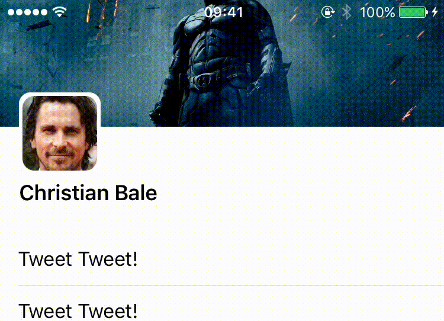

# TwitterUIViewController

A Twitter-inspired UIViewController written entirely in Swift, no Interface Builder needed.

## Credits

Thanks to [@ariok](https://github.com/ariok/TB_TwitterUI) and [@deanbrindley87](https://github.com/deanbrindley87/Twitter-UI) for the inspiration.

## License

TwitterUIViewController is released under the MIT license. See LICENSE for details.
